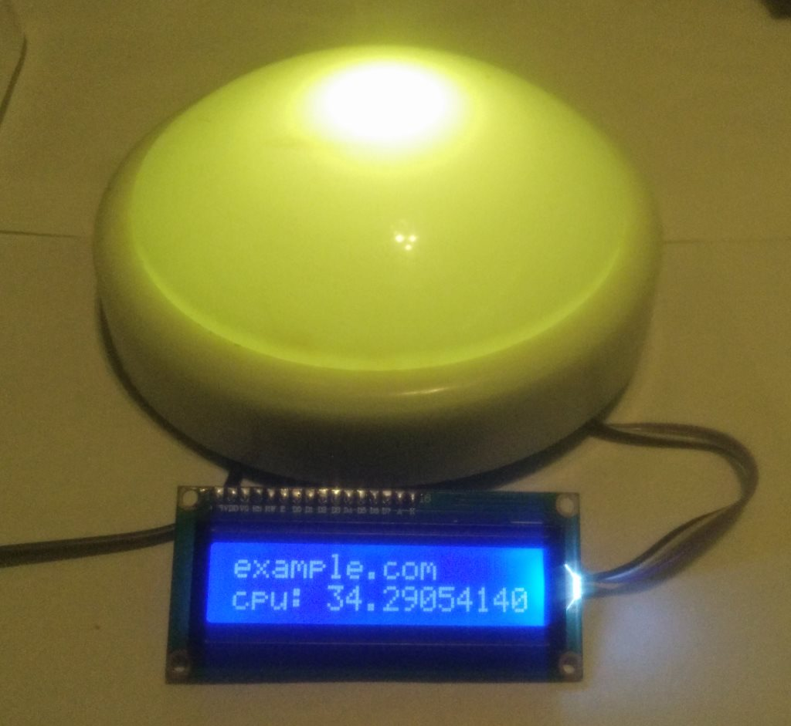

[](https://travis-ci.org/popstas/pixel-server)
[](https://coveralls.io/github/popstas/pixel-server?branch=master)

Server for send signals to [arduino pixel_meter](https://github.com/popstas/arduino-pixel-meter)
or [AnyBar](https://github.com/tonsky/AnyBar).



# Usage
- Start server, it will default listen at *:8246
- Send POST request to `/status` like this:
```
http -f POST http://localhost:8080/status value=50 message='first string\\second string' blink=2
```
- Or configure your [Kapacitor](https://github.com/influxdata/kapacitor) to `/kapacitor` like this:
```
data
    |alert()
        .post('http://localhost:8246/kapacitor')
```

# Configure server

### Command-line parameters
```
pixel-server \
--web-host="" \
--web-port=8246 \
--serial-port=COM3 \
--serial-speed=9600
--anybar-port=1738
--brightness=100
```

### Environment variables
```
PIXEL_SERVER_SERIAL_PORT=COM3 \
PIXEL_SERVER_SERIAL_SPEED=9600 \
PIXEL_SERVER_WEB_HOST= \
PIXEL_SERVER_WEB_PORT=8246 \
PIXEL_SERVER_ANYBAR_PORT=1738 \
PIXEL_SERVER_BRIGHTNESS=100 \
pixel-server
```

Command-line parameters has priority over environment variables.

### Request parameters for /status
- `value` - value of signal, required,  
   0 to 100 (red to green),  
   -1 for off led
- `message` - message for 16x2 display, lines should be splitted with \ symbol, default no message
- `blink` - blink state, default 0,  
   0 for not blinking,  
   1 for blink 3 times and back to previous state,  
   2 for persistent blinking
- `brightness` - led brightness, 0 to 100, default 100

Examples:
```
http -f POST http://localhost:8246/status value=50
```

## Behaviour
If status changes from red to green, will be used smooth color change.
If status changes from green to red, color will changed with blinking with last color.